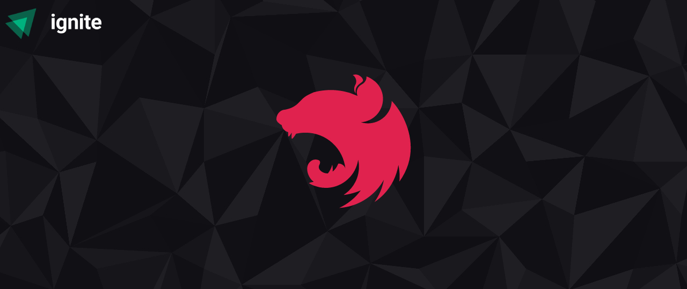

<h1 align="center">
  
</h1>

<p align="center">
  
  
  
</p>

<h1 align="center">
    Notifications Service
</h1>
<p align="center">Um microserviço de notificações</p>

<p align="center">
 <a href="#-sobre-o-projeto">Sobre o Projeto</a> •
 <a href="#-tecnologias">Tecnologias</a> •
 <a href="#-configurando-o-ambiente">Configurando o Ambiente</a> •
 <a href="#-licença">Licença</a>
</p>

## 📌 Sobre o projeto

Este projeto foi desenvolvido durante o evento Ignite Lab Node disponibilizado pela Rocketseat e consiste basicamente em um microserviço de notificações. Foi feito utilizando o framework Nest, aplicando conceitos como a inversão e injeção de dependências. Os testes foram escritos utilizando Jest e a camada de persistência de dados foi desenvolvida com a ajuda do Prisma ORM.

---

## 💻 Tecnologias

- [Node](https://nodejs.org/)
- [Nest](https://nestjs.com/)
- [Typescript](https://www.typescriptlang.org/)
- [Prisma](https://www.prisma.io/)
- [Jest](https://jestjs.io/)

---

## 🌱 Configurando o ambiente

### 🚧 **Requisitos**

> Será necessário instalar os items abaixo para clonar e executar o projeto corretamente!

- [Git](https://git-scm.com/)
- [Node](https://nodejs.org/)

### ⏩ **Clonando e executando a aplicação**

```bash
# Primeiro clone o repositório utilizando git:
$ git clone https://github.com/diegonatalo/notifications-service.git

# Depois acesse a pasta do projeto:
$ cd notifications-service

# Em seguida instale as dependências:
$ npm i

# Por fim, inicie a aplicação:
$ npm run start:dev
```

---

## 📜 Licença

Distribuído sob a licença MIT. Veja [LICENSE](LICENSE) para mais informações.

---

Feito com ❤️ por Deigo Natalo.
